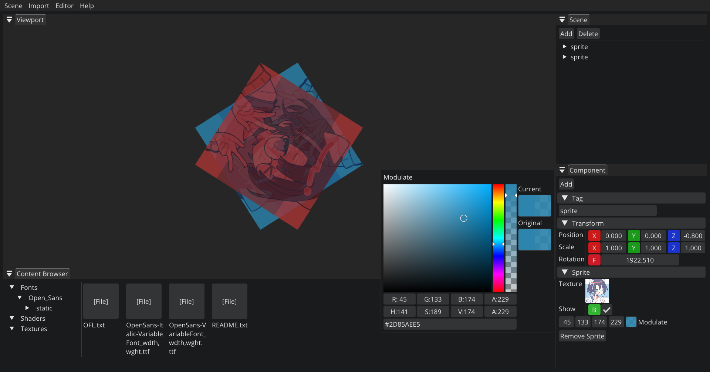

# [DuaEngine] 🎮

玩具级别学习用2D游戏引擎\
学习自Cherno大佬的Hazel 

  

---

## 🗓️ 里程

- **（持续更新中。。。）** 🔨
- **2025/05/06** 接入box2d初步
- **2025/05/03** 接入了lua初步
- **2025/04/30** 资源浏览器初步
- **2025/04/29** 序列化反序列化实现（还不支持原生脚本）
- **2025/04/22** 加了个yaml的库以后做场景保存
- **2025/04/14** 场景管理窗口初步（还只有sprite和transform）
- **2025/04/13** 加入了cpp原生脚本组件
- **2025/04/12** 加入entt，加入了sprite组件
- **2025/03/24** 2D渲染器，批处理渲染
- **2025/03/17** 着色器库，wasd鼠标控制摄像机
- **2025/03/05** 加载shader文本文件
- **2025/03/03** 加载纹理
- **2025/03/02** 加入了Transform，写了Shader抽象
- **2025/03/01** 把测试代码从引擎库中分离，加入了Timestep
- **2025/02/28** 加入了正交相机
- **2025/02/27** 完成了顶点缓冲区、顶点数组等抽象
- **2025/02/24** 输入事件竣工（大概），准备开始写渲染的抽象

---

## 🫓 画饼

- 想一个独特的文件系统（工程 场景 预制体 资源 什么的）
- 将ENet作为网络模块

---

## 🗒️ 待办

- 在OpenScene的时候 entt时不时报错：Assertion failed: ((has_single_bit(mod)) && ("Value must be a power of two")) 但是好像好久都没见到了还是说被我不小心修了我没注意到？
- Lua直接修改Position分量的时候无法触发set
- 运行模式切换回编辑模式的时候复原场景
- 物理组件读取到SceneHierarchy
- Lua集成补全
- 剩余组件序列化反序列化补全
- 主循环分离
- 物理体碰撞盒编辑方式以及编辑时视窗内显示
- 相机组件
- ~~删除Sprite的时候可能是Renderer2D有问题图片会残留在上面（已修复，OpenGLRendererAPI有个地方写反了）~~
- ~~鼠标缩放应该只能在鼠标悬浮在viewport上的时候才起效（已解决）~~

---

## 📥 依赖项
- [Visual Studio](https://visualstudio.microsoft.com/) - Microsoft官方IDE
- [GLFW](https://www.glfw.org) - 跨平台窗口/输入管理  
- [GLAD](https://glad.dav1d.de/) - OpenGL扩展加载器
- [GLM](https://glm.g-truc.net) - 数学库
- [ImGui](https://github.com/ocornut/imgui/tree/docking) - 即时模式调试UI框架 
- [EnTT](https://github.com/skypjack/entt) - ECS框架 
- [LuaJIT](https://luajit.org/) - Lua脚本语言
- [Box2d](https://box2d.org/) - 2d物理引擎